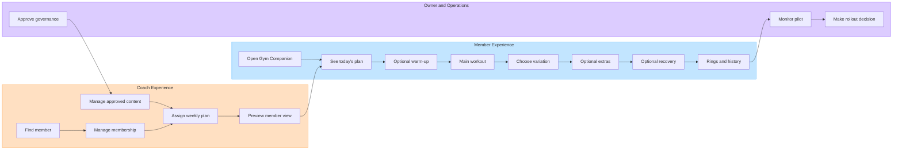
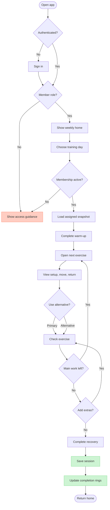
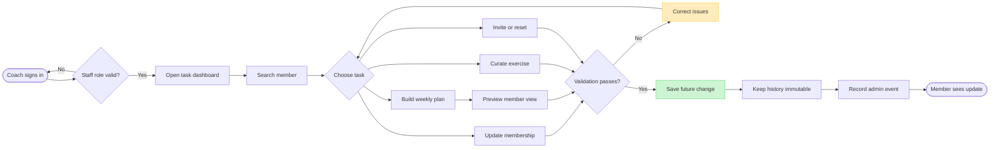
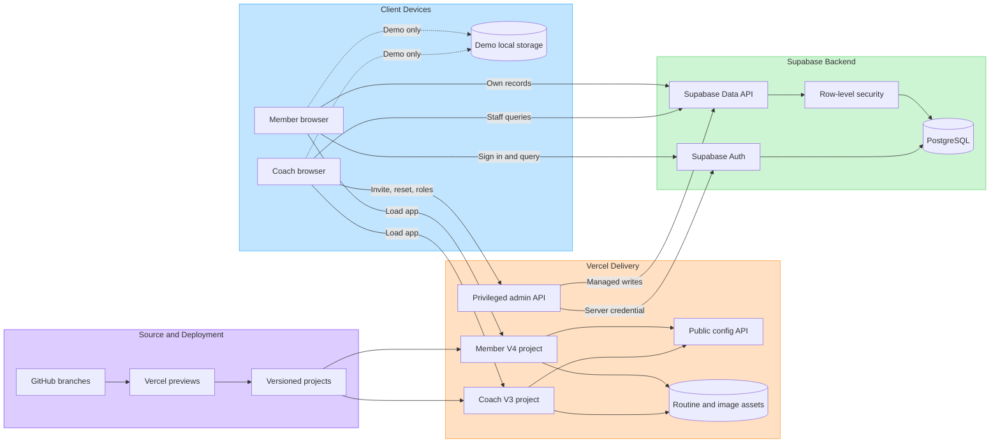
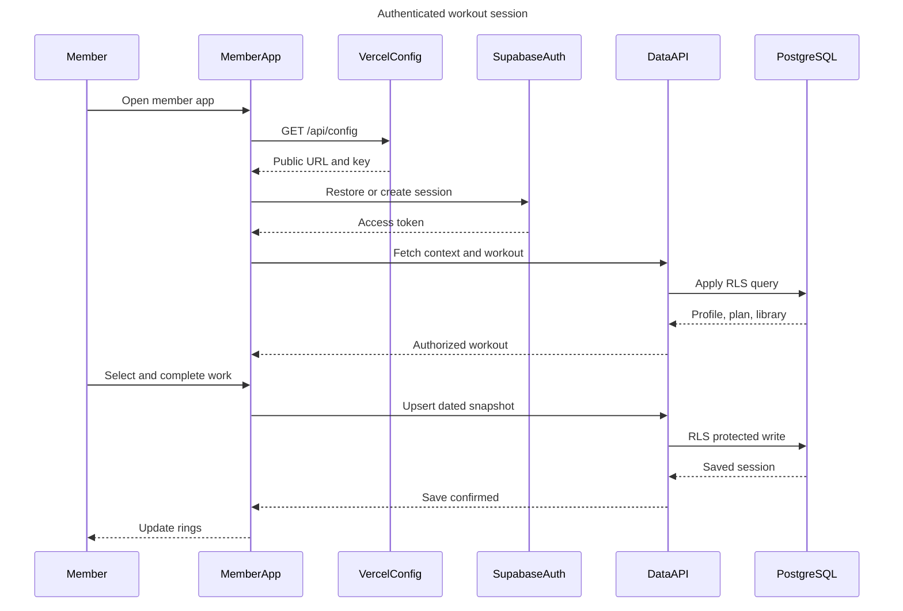
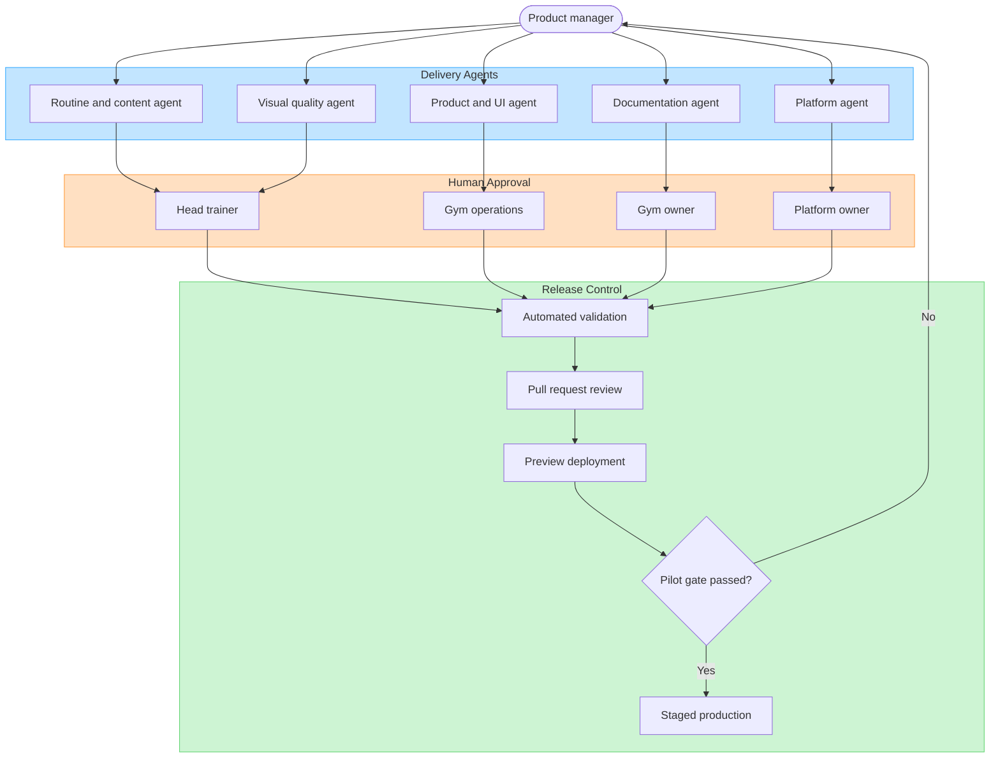

# Fitness 7 Gym Companion — GPM Review and System Blueprint

| Field | Value |
|---|---|
| Review lens | Senior / Group Product Manager |
| Reviewed sources | `PRD.md`, `V5-V7-PRODUCT-SCOPE.md`, V4 member code, V3 coach code, Supabase migrations, `AGENTS.md` |
| Review date | 11 August 2026 |
| Product owner | Sagar Paperwala, Product Manager — Fitness 7 |
| Decision requested | Approve a controlled 50-member pilot only after P0 readiness gaps are closed |

## 1. Executive assessment

Gym Companion has a credible member problem, a differentiated visual-first experience, and a sensible staged roadmap. The documents are strong enough to align a gym owner and trainer team around the opportunity. They are not yet sufficient to approve a production rollout to 1,000 members.

The central product-management issue is **readiness ambiguity**. The documentation combines three different states:

1. A public V4 showcase with rich workout guidance.
2. A V3 technical foundation for accounts, roles, plans, and membership management.
3. A future production operating model that still needs governance, instrumentation, security validation, support ownership, and controlled data migration.

The recommended decision is **conditional approval for a 50-member pilot**, not full launch approval. V5 should begin with a short production-readiness tranche that closes the P0 gaps below before real member data is onboarded.

## 2. Product scorecard

Scores use a five-point scale: 1 = missing, 3 = directionally defined, 5 = decision-ready and operationalized.

| Area | Score | GPM assessment |
|---|---:|---|
| Problem and member value | 4 | The gym-floor friction and visual-guidance need are clear and believable. |
| Product vision and principles | 4 | Mobile-first, visual-first, safe, and low-friction principles are coherent. |
| Current experience definition | 4 | Daily routines, alternatives, detailed visuals, optional work, and progress are well described. |
| Release narrative | 3 | V1–V4 learning is useful, but showcase, demo, foundation, and production capability need a formal status matrix. |
| Pilot design | 3 | Cohort and outcome targets exist; duration, sampling, baseline, instrumentation, and stop rules are incomplete. |
| Business case | 2 | ₹60,000 gross annual cost avoidance is clear, but total cost of ownership and break-even are absent. |
| Measurement and analytics | 2 | Metrics exist without event definitions, baselines, owners, reporting cadence, or data-quality controls. |
| Safety and content governance | 2 | Safety intent exists; clinical/trainer review, contraindication handling, incident workflow, and publishing controls do not. |
| Privacy and security operations | 2 | Supabase RLS and role separation are a good foundation; production policies, tests, retention, and response processes remain open. |
| Operational readiness | 2 | Support, training, onboarding, release ownership, monitoring, and recovery need executable runbooks. |
| Roadmap quality | 3 | V5–V7 is logically sequenced, but dependencies, capacity, and measurable exit criteria need tightening. |

## 3. Highest-priority gaps

### P0 — close before real-member pilot

| Gap | Why it matters | Required decision or artifact | Accountable owner |
|---|---|---|---|
| Product-state ambiguity | Stakeholders may mistake demo behavior for production capability. | Publish a capability matrix: live, demo-only, technically available, pilot-ready, or roadmap. | Product |
| No production-readiness definition | “Pilot-ready” is not a reproducible standard. | Create a go-live checklist covering auth, data migration, RLS, backups, monitoring, support, content approval, and rollback. | Platform + Product |
| Safety governance is incomplete | Exercise advice can create member harm and brand risk. | Head-trainer approval workflow, contraindication intake, injury escalation, content versioning, and incident protocol. | Head Trainer |
| Privacy operations are undefined | Profiles, memberships, goals, and workout history are personal data. | Privacy notice, consent basis, retention/deletion schedule, data export process, breach response, and processor register. | Owner + Platform |
| Security controls are not evidenced | Architecture claims do not prove isolation. | Automated RLS tests, role-escalation tests, admin API rate limits, session-revocation tests, secret rotation, and dependency review. | Platform |
| Measurement plan is not implementable | Pilot success cannot be evaluated consistently. | Event taxonomy, metric formulas, baselines, dashboards, owners, and weekly reporting cadence. | Product + Analytics |
| Pilot design lacks operating detail | A 50-member pilot can fail through selection bias or unsupported onboarding. | Define duration, location split, cohort criteria, trainer coverage, onboarding script, support SLA, feedback method, and stop conditions. | Product + Operations |
| Business case excludes delivery cost | ₹60,000 is gross avoidance, not net value. | Add hosting, implementation, trainer/content time, support, monitoring, and contingency costs; calculate year-one and steady-state cost. | Product + Owner |
| Brand and illustration rights need confirmation | Public deployment may expose Fitness 7 and image assets to rights disputes. | Written brand authorization and an asset provenance/license register. | Owner + Product |

### P1 — close during the pilot before expansion

| Gap | Consequence | Recommendation |
|---|---|---|
| Workout duration conflicts with adherence | Ten base movements, extras, warm-up, and recovery can produce 90–120 minute sessions. | Separate “prescribed session” from “exercise library”; enforce a time budget and mark priority movements. |
| Personalization hierarchy is underspecified | Experience tier alone cannot safely assign a plan. | Order rules by contraindications/injuries, goal, experience, equipment/location, schedule, recovery, then preference. |
| No offline/poor-network policy | Gym connectivity failures recreate the original problem. | Cache the current week, images, and pending checkmarks; define conflict resolution after reconnection. |
| Content operations lack lifecycle rules | Incorrect or stale guidance can persist. | Add draft, trainer review, approved, published, archived states with version and rollback. |
| Admin permissions are too broad conceptually | Two locations may require limited staff access. | Define role-by-location permissions and separation for owner, admin, trainer, and support. |
| Accessibility lacks a target | “Accessible” cannot be tested consistently. | Adopt WCAG 2.2 AA for member and coach flows with keyboard, contrast, focus, text scaling, and screen-reader tests. |
| Support and incident handling are not staffed | Adoption falls when sign-in, plan, or content issues linger. | Define support channel, severity levels, owner, acknowledgement time, resolution targets, and member communication. |
| Scale assumptions are untested | 1,000 records is small, but image delivery, concurrent sessions, and admin queries still need evidence. | Load-test peak gym windows and measure p95 page load, query latency, error rate, and Supabase/Vercel quotas. |
| README and release documentation are stale | Operators may follow V3 instructions for V4. | Add a release matrix and V4-specific setup, migration, environment, and rollback instructions. |

### P2 — shape V6 and V7 before build

- Define home-to-gym exercise substitution rules and trainer approval boundaries.
- Define goal plans as measurable programs, not labels; include reassessment cadence and plateau handling.
- Add healthy gamification rules: rest days protect streaks, no reward for unsafe volume, challenge opt-out, and private-by-default rankings.
- Plan localization for language, units, exercise naming, and accessibility across the two locations.
- Define account/data portability, deletion, and treatment of members under 18 before broader onboarding.
- Validate retention or revenue upside separately from confirmed cost avoidance.

## 4. Missing product decisions

These questions should be answered in a short pilot decision record:

1. Is V5 a replacement for the existing Fitness 7 app, a companion, or a controlled fallback?
2. Who is the legal data controller, and who responds to access/deletion requests?
3. Which trainer has final authority over each program and exercise illustration?
4. What is the acceptable maximum prescribed workout duration by level?
5. Can members self-change programs, or must trainer assignment override member preference?
6. What happens when membership expires: read-only history, immediate lockout, or grace period?
7. Which location can each trainer/admin access?
8. What is the offline promise inside the gym?
9. What constitutes a safety incident, and who pauses affected content?
10. What exact pilot outcome authorizes expansion from 50 to 250, then 1,000 members?

## 5. Recommended release correction

Use four explicit product states instead of treating a version number as proof of readiness:

| State | Meaning | Current example |
|---|---|---|
| Showcase | Public experience for demonstration; may contain browser-local demo behavior. | V4 member experience |
| Foundation | Architecture and data model exist but require operational configuration and evidence. | V3 accounts/admin/Supabase foundation |
| Pilot-ready | P0 controls, content approval, instrumentation, support, and rollback are complete. | V5 Gate A target |
| Production | Pilot gates passed; monitored staged rollout is approved. | V5 staged rollout target |

Recommended V5 gates:

- **Gate A — Trust:** safety, privacy, security, content rights, and role boundaries approved.
- **Gate B — Operability:** onboarding, support, monitoring, backup, migration, and rollback tested.
- **Gate C — Pilot evidence:** 50-member cohort meets activation, reliability, usability, and support thresholds.
- **Gate D — Scale:** capacity and location-based operating model validated before 250 and 1,000-member waves.

## 6. Functional architecture

## 7. End-to-end member flow

## 8. Coach and gym-operations flow

## 9. Current technical architecture

This diagram reflects the repository implementation, not the full V5 target state. Member and coach experiences are separate Vercel deployments. The browser uses the Supabase anonymous key with row-level security; privileged actions use the coach deployment's server-side API and service credential. Exercise images are versioned static assets. Demo-mode changes remain in browser storage.

## 10. Technical workout-session sequence

## 11. Agent and ownership model

“Agents” here are bounded workstreams. They do not replace accountable human approval. Product coordinates the system; training, operations, owner, and platform leads retain decision rights.

### Agent boundaries

| Workstream | Responsible for | Must not approve alone | Required handoff |
|---|---|---|---|
| Routine and content | Split, exercise bank, prescriptions, alternatives, equipment compatibility, progression | Medical/safety policy or production publishing | Head-trainer review and content version |
| Visual quality | Accurate three-phase art, framing, alt text, asset validation | Movement correctness | Routine agent + head trainer |
| Product and UI | Mobile flow, accessibility, completion, history, motivation | Training prescription or security readiness | Usability evidence + accessibility checks |
| Platform | Auth, RLS, APIs, migrations, environments, monitoring, backup, deployment | Business rollout | Security evidence + rollback plan |
| Documentation | PRD, runbooks, release notes, traceability | Product scope or final launch | Approved source owners |

## 12. Target V5 technical additions

The current architecture needs the following production components or explicit operating capabilities before the pilot:

- Analytics event collection and a privacy-reviewed metric layer.
- Error monitoring, uptime checks, and alert routing.
- Automated RLS and privileged-API security tests.
- Auditable content publishing with draft, approval, version, archive, and rollback states.
- Backup/restore verification and a member-data retention/deletion workflow.
- Cached current-week workout and image access for poor connectivity.
- Location-aware staff permissions.
- Rate limiting and abuse protection for invitations and password resets.

## 13. Recommended pilot measurement specification

| Metric | Exact definition | Source | Cadence | Owner |
|---|---|---|---|---|
| Activation | Invited member starts one main exercise within seven days | Auth + workout events | Weekly | Product |
| First-workout friction | Median time from authenticated home load to first completed main exercise | Client events | Weekly | Product/UI |
| Workout completion | Sessions with all prescribed main slots complete ÷ sessions started | Session snapshots | Weekly | Product |
| Alternative self-service | Members selecting an alternative without trainer intervention in observed tasks | Usability study | Pilot midpoint/end | Product + Trainers |
| Reliability | Successful authenticated workout loads ÷ attempted loads | Monitoring | Daily | Platform |
| Trainer deflection | Basic exercise-demonstration requests per 100 member visits versus baseline | Trainer tally | Weekly | Operations |
| Support burden | Issues and median resolution time per 100 active members | Support log | Weekly | Operations |
| Four-week retention | Activated members completing a workout in week four | Sessions | Pilot end | Product |
| Net operating value | Avoided maintenance less hosting, support, content, and engineering cost | Finance log | Quarterly | Owner + Product |

## 14. Ninety-day decision plan

### Days 0–14 — Trust and readiness

- Freeze the pilot capability matrix and data model.
- Obtain brand, visual, and training-content approvals.
- Complete privacy, retention, deletion, security, backup, and incident runbooks.
- Instrument the agreed pilot events and establish baselines.
- Test the full member and coach flow with synthetic accounts.

### Days 15–45 — Controlled 50-member pilot

- Balance participants across both locations, experience levels, and trainer-dependence profiles.
- Run structured onboarding and capture first-workout friction.
- Review safety, support, reliability, and adoption weekly.
- Pause affected content or expansion when a P0 threshold fails.

### Days 46–90 — Evidence and staged scale

- Resolve critical findings and repeat failed usability/security tests.
- Calculate net operating cost and trainer time impact.
- Approve, revise, or stop the next wave through a documented gate review.
- If approved, expand in measured cohorts rather than onboarding all 1,000 members at once.

## 15. Final recommendation

Proceed with Gym Companion as a **controlled Fitness 7 pilot product**. Do not yet position V4 as a production replacement for the existing application. The product has enough member value to justify the pilot, but full rollout should be conditional on P0 safety, privacy, security, measurement, operating, and business-case work. V5 should prioritize trust and operability before adding breadth; V6 and V7 should be released only after the core experience demonstrates reliable weekly use.
